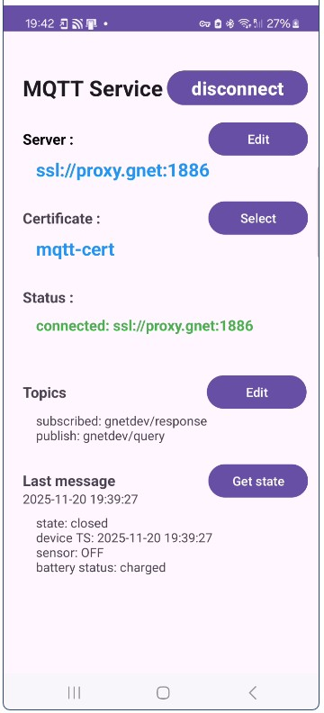
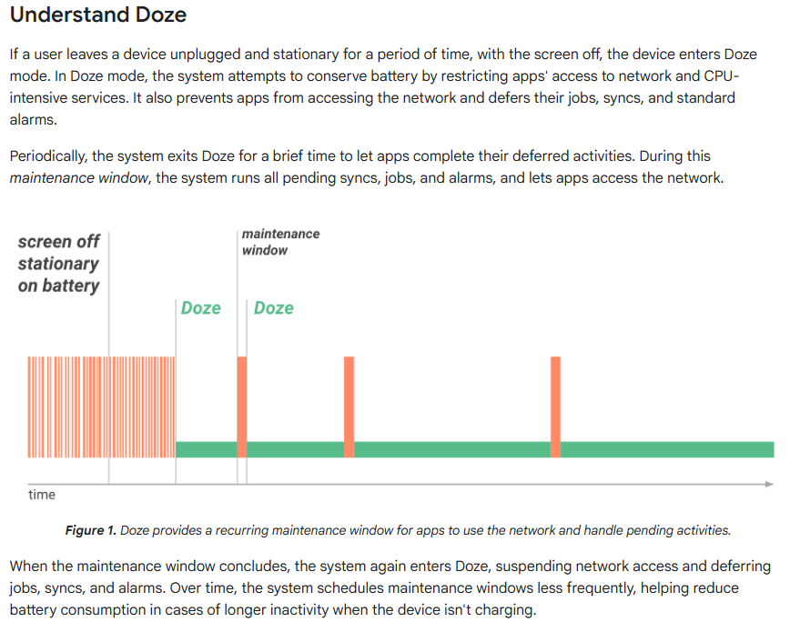

# mqtt-service
Android MQTT service

# Overview
This Android application implements a foreground service which communicates with a MQTT broker, for remote monitoring and control of some other devices connected to broker.
The service has 2 notifications channels: the first one is for the connection state and the second is for incoming messages.
The MQTT broker is **mosquitto** broker (https://mosquitto.org/) accepting ssl connections with 2 way certificate based authentication. 
Android service is using Eclipse paho client (https://eclipse.dev/paho/clients/android/) and uses for authentication the certificates stored on the android device.
Certificate infrastructure is a self signed one with PKI and certificates generated using Easy-RSA (https://github.com/OpenVPN/easy-rsa)

&emsp;&emsp;&emsp;&emsp;&emsp;&emsp;

To connect and communicate with broker, the following parameters are required
- broker URL in the form **ssl://server-name:port**
- certificate alias, which is the alias you choose when installing the client certificate (note that CA certificate needs also to be installed to allow **KeyChain** to retrieve the full chain of certificates)
- MQTT topics - 1 to subscribe and 1 to publish

All these parameters are persistent in the app preferences

# SSL certificates
To implement 2-way authentication certificate based, it requires the client certificate and key and the root CA certificate.
All these have to be installed on your device in order to allow the service to connect to the broker.
As i said i used easyRSA to create my own PKI self-signed infrastructure and generate server certificate and key and client certificate and key.
My mosquitto broker is configured to accept TLS connection on port 1886 with the options below
> **require_certificate true**
> **use_subject_as_username true**

On the phone the client certificate is installed using **Install from device storage --> VPN and app user certificate** option, while CA certificate is installed using **Install from device storage --> CA certificate**.
For the example in the code i used the client certificate with the alias **mqtt-cert**. 
Certificates retrieval is using **KeyChain** APIs
# Class structure
## MQTTService.java
Implements the service which is started in the foreground, connects to the broker, publish and receive messages using the 2 topics: **publishTopic** and **subscribeTopic**
The service is started by the main activity or by **MQTTReceiver** after phone reboot.
It uses 2 notification channels:
> **NOT_STATE_ID = 1** --> state notification channel. 
&emsp;  
Display connection status: connected or disconnected to broker.

> **NOT_MSG_ID = 101** --> message received 
&emsp;  
when a message is received from broker on subscribed topic

NOT_STATE_ID channel supposed to be nondismissible, but unfortunately starting Android 14 this is no longer possible: 
[**"The behavior of FLAG_ONGOING_EVENT has changed to make such notifications actually dismissable by the user."**](https://developer.android.com/about/versions/14/behavior-changes-all#non-dismissable-notifications)
So the user can dismiss it. However if the connection state change. the notification will be shown again. Still "Clear notifications" option does not remove it from the list. 

When the service is started, it try to connect to server by calling **connect2Server()**.
The certificates to be used for broker authentication are set by the **SSLSocketFactiory** in function **getSF()**.
The result of the connect attempt, or any change in connection state,  is notified to user using NOT_STATE_ID channel and to the app main screen via broadcastUpdate(). If connection is successful the service subscribes to **subscribeTopic**.

When a message is received via subscribed topic it is notified using NOT_MSG_ID channel and broadcasted to mainActivity via broadcastUpdate() function.

When the service is started, if the server URL and certificate alias can be retrieved from app preferences, it will try to connect to broker. If subscribe topic can be retrieved it will subscribe to it.

## MainActivity.java
 
Is the application launcher and implements user interface.
It includes 2 inner classes:

> &emsp; BroadcastReceiver **receiver**
It receives broadcastUpdates form MQTTService

> &emsp;  ServiceConnection **mConnection**
It handles service connection / disconnection events

The UI lets you specify the connection parameters and to update them according to the needs.
It controls broker connection state and displays last message received on the subscribed topic. It also provides possibility to send a predefined message using publish topic.
parseMessage() function is left empty here, because it depends on the specific of the received message.

## MQTTReceiver.java

Its a small class implementing a BroadcastReceiver registered in app manifest, used to automatically start the service after phone boot.
The filter allow receiving BOOT_COMPLETED and LOCKED_BOOT_COMPLETED system messages. I saw some discussions that other messages might also be broadcasted by system after boot, but the only message I got is BOOT_COMPLETED. 

## getCertificate.java

This class is needed only because android forbids selecting the certificates in the main thread of app.
In MainActivity certificate selection is done via  **KeyChain.choosePrivateKeyAlias()** which creates its own thread, but in the case the service is started at boot, without UI, the service needs to retrieve the certificates using alias stored in app preferences. So **getCertificate** class implements a thread for this purpose.

## HeartBeat.java
This class was intended to keep connection active by sending a dumb message to broker at an interval much shorter than MQTT **keepAlive**. (e.g if **keepAlive** set to 200 sec, send a message every 20 seconds).
I was hoping that even doze mode will degrade the rate, still **HearBeat->t_wait()** thread will have the chance to send at least one message during **keepAlive** interval.
But maintenance window goes much larger than **keepAlive** and **HearBeat->t_wait()** its not scheduled at all within the required interval. Some point in time the client gets disconnected because of inactivity.

It is no longer used, but I still keep it in the repository 

# Keeping permanent alive connection

My plan is to use this application to monitor couple of critical sensors (water and heating) placed in my house. So, I need to ensure a permanent and reliable connection with the broker and that proved to be a big challenge with Android. 
According to MQTT protocol, the client needs to show some activity towards broker (send or receive a message) within **keepAlive** interval + grace period (usually 50% of **keepAlive** interval). If client is idle, it has to send a PINGREQ message to broker, at least every **keepAlive** interval. If broker misses client activity during this interval, will disconnects it because of inactivity. 
Paho client implementation contains PINGREQ/PINGRSP procedure which is activated in case no message is sent/received during **keepAlive** interval. Together with **automaticReconnect** set to true, it might look keeping connection active is out of the box. 
Here comes into the picture Android power management, which starts to throttle execution of background processes as soon as the phone goes idle (screen locked and black) and no charger connected. And it gets really bad when it enters doze mode.
Here is a capture with the description of the doze mode form official documentation (https://developer.android.com/training/monitoring-device-state/doze-standby)
>> 

Which means the piece of code, in paho client implementation, responsible for sending PINGREQ messages, is no longer scheduled based on its programmed timing rate, but during maintenance window. Looking closer,  **“..Over time, the system schedules maintenance windows less frequently...”**, which some point in time exceeds the **keepAlive** interval specified in connection parameters, and broker disconnects the client. The other connection parameter, **automaticReconnect**, if set to true will force a reconnection, and everything looks to be ok, but there are 2 drawbacks:
1. because of the maintenance window reconnect might happen immediately or in the next window. It might take 10s of minutes until reconnect happens, while I might loose critical events reported by the sensors.
2. I want my phone to notify me on any critical event (with sound and vibration) and disconnect/reconnect is one of them. I don't want on late night the phone to wake me up only because Android maintenance window wants to tell me something.

So, the timings of client PINGREQ/PINGRSP procedure, or HeartBeat, are disregarded and from time to time, connection gets dropped and reestablished again. This might be acceptable if you can live with the 2 drawbacks, but i cannot.

The solution i found is to let the monitored devices to publish a periodic message to a dedicated "keepAlive" topic and Android MQTT service to subscribe to this topic.
The documentation states the following behavior (https://source.android.com/docs/core/power/platform_mgmt)
- **doze (lightweight) non-stationary**: 
-- "All real-time messages (instant messages, calls, etc.) received; high-priority push notification message enables temporary network access"
- **doze stationary**:
 -- "Only high-priority push notification messages received"

Not sure if a MQTT message is part of "high-priority push notification", but after several days of testing with **keepAlive** set to 200 sec on client side and the device sending a message every 100 sec, I get only 2 - 3 infrequent disconnects per day, none of that because client inactivity.
So it works, but only **if you are in a fortunate position where you can adjust some device in your network to send - in a reliable way - these "keepAlive" messages**.

Bottom line Android is pricing more battery saving and when it comes to choose between battery life and timely based execution, it definitely choose the battery.
